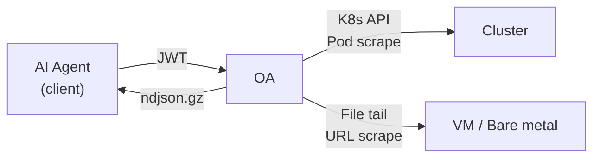

# OA — Observability Agent

> Read-only data gateway for logs, events, and metrics. Supports both Kubernetes clusters and bare metal/VM servers (standalone mode).

OA exposes a simple REST API. AI agents (or any HTTP client) authenticate with a JWT, request a **bundle** of observability data, and receive a compressed NDJSON stream ready for analysis.



---

## Features

- **Bundle-first workflow** — request a bundle, poll for completion, download a single `.ndjson.gz` artifact
- **Dual mode** — auto-detects K8s or standalone via `KUBERNETES_SERVICE_HOST`
- **Logs** — K8s container logs, local file tail, or journalctl (systemd), with timestamp parsing, time-window filtering, and exclude patterns
- **Events** — K8s events scoped to target pods (K8s mode only)
- **Metrics** — Prometheus scraping from pod annotations (K8s) or configured URLs (standalone)
- **JWT auth** — HS256 shared-secret authentication with mandatory `exp` claim
- **Hard limits** — configurable caps on pods, log lines, and inflight bundles
- **Zero write** — purely read-only; never modifies cluster or server state

## Quick Start

### K8s Mode

```bash
npm install && npm run build
export OA_JWT_SECRET="your-secret-here"
npm start
# → K8s mode detected, listening on http://0.0.0.0:8080
```

### Standalone Mode

```bash
npm install && npm run build
export OA_JWT_SECRET="your-secret-here"
export OA_SERVICES='[
  {"name":"solana-validator","logs":["/var/log/solana/validator.log"],"metrics":"http://localhost:9090/metrics"},
  {"name":"rpc-node","logs":["/var/log/solana/rpc.log"]}
]'
npm start
# → Standalone mode, listening on http://0.0.0.0:8080
```

## API

### Common Endpoints

| Method | Endpoint | Description |
|--------|----------|-------------|
| `GET` | `/healthz` | Health check (no auth) |
| `GET` | `/skill.md` | Skill manifest for AI agents (no auth) |
| `POST` | `/v1/bundles` | Create a new observability bundle |
| `GET` | `/v1/bundles/:id` | Check bundle status |
| `GET` | `/v1/bundles/:id/download` | Download completed bundle (`.ndjson.gz`) |

### K8s Mode

| Method | Endpoint | Description |
|--------|----------|-------------|
| `GET` | `/v1/pods?ns=*&q=<name>` | Search pods by namespace, label selector, or name |

### Standalone Mode

| Method | Endpoint | Description |
|--------|----------|-------------|
| `GET` | `/v1/services` | List registered services |

### Create a Bundle — K8s

```bash
curl -X POST https://oa.example.com/v1/bundles \
  -H "Authorization: Bearer $TOKEN" \
  -H "Content-Type: application/json" \
  -d '{
    "timeWindow": { "sinceSeconds": 600 },
    "target": {
      "namespace": "production",
      "selector": "app=api"
    },
    "include": {
      "logs":    { "enabled": true, "tailLines": 2000, "previous": true },
      "events":  { "enabled": true },
      "metrics": { "enabled": true }
    }
  }'
```

### Create a Bundle — Standalone

```bash
curl -X POST https://oa.example.com/v1/bundles \
  -H "Authorization: Bearer $TOKEN" \
  -H "Content-Type: application/json" \
  -d '{
    "timeWindow": { "sinceSeconds": 600 },
    "target": {
      "kind": "services",
      "services": ["solana-validator"]
    },
    "include": {
      "logs":    { "enabled": true },
      "metrics": { "enabled": true }
    }
  }'
```

### NDJSON Record Types

| Type | Mode | Description |
|------|------|-------------|
| `meta` | Both | Bundle metadata (bundleId, params, timestamps) |
| `log` | K8s | Container log line (namespace, pod, container, ts, line) |
| `log` | Standalone | File log line (service, file, ts, line) |
| `log` | Standalone | Journal log line (service, journal, ts, line) |
| `event` | K8s only | K8s event (reason, message, involvedObject) |
| `metrics_text` | K8s | Pod metrics scrape (namespace, pod, port, path) |
| `metrics_text` | Standalone | Service metrics scrape (service, url) |

## Configuration

All configuration is via environment variables with sensible defaults:

### Common

| Variable | Default | Description |
|----------|---------|-------------|
| `OA_JWT_SECRET` | **required** | HS256 shared secret for JWT verification |
| `OA_PORT` | `8080` | HTTP listen port |
| `OA_BUNDLE_DIR` | `/tmp/oa-bundles` | Directory for bundle artifacts |
| `OA_BUNDLE_TTL_MINUTES` | `60` | Bundle artifact TTL |
| `OA_MAX_INFLIGHT_BUNDLES` | `5` | Max concurrent bundle jobs |
| `OA_MAX_TOTAL_LOG_LINES` | `50000` | Hard limit on total log lines |
| `OA_SINCE_SECONDS_MAX` | `3600` | Max time window (1 hour) |
| `OA_METRICS_TIMEOUT_MS` | `2000` | Per-target metrics scrape timeout |
| `OA_ALLOWED_IPS` | *(none)* | Comma-separated IP/CIDR allowlist (e.g. `10.0.0.1,192.168.0.0/16`) |
| `OA_TRUST_PROXY` | *(none)* | Fastify `trustProxy` — `"true"` to trust all proxies, or a specific address/CIDR |

### K8s Only

| Variable | Default | Description |
|----------|---------|-------------|
| `OA_MAX_PODS` | `20` | Hard limit on pods per bundle |
| `OA_MAX_METRICS_PODS` | `20` | Max pods for metrics scraping |

### Standalone Only

| Variable | Default | Description |
|----------|---------|-------------|
| `OA_SERVICES` | **required** | JSON array of service definitions |

`OA_SERVICES` format:
```json
[
  { "name": "svc-name", "logs": ["/path/to/log"], "journal": "unit.service", "metrics": "http://host:port/metrics" }
]
```

- `name` (required): unique service identifier
- `logs` (optional): array of log file paths to tail
- `journal` (optional): systemd unit name for journalctl log collection
- `metrics` (optional): Prometheus metrics URL to scrape

## Testing

```bash
npm test                 # run all tests
npm run test:watch       # watch mode
npm run test:coverage    # coverage report (98%+ target)
```

```
18 test files · 473 tests · 98%+ coverage
```

## Architecture

```
src/
├── index.ts             # Fastify app bootstrap, mode branching
├── config.ts            # Environment-based configuration + mode detection
├── auth.ts              # JWT authentication hook
├── ip-filter.ts         # IP allowlist filter hook
├── types.ts             # Shared type definitions (BundleJob, BundleStatus)
├── log-utils.ts         # Shared log parsing utilities
├── bundle-manager.ts    # Bundle lifecycle + cleanup (generic)
├── bundle-writer.ts     # NDJSON gzip stream writer
├── semaphore.ts         # Concurrency limiter
├── http-error.ts        # HTTP error class
├── util.ts              # Shared utilities
├── skill.ts             # Skill manifest loader
├── k8s/
│   ├── client.ts            # K8s client factory
│   ├── compat.ts            # K8s client-node version compatibility
│   ├── types.ts             # K8s-specific types (PodRef, BundleRequest)
│   ├── validate.ts          # K8s request validation + normalization
│   ├── routes.ts            # K8s HTTP route handlers
│   ├── pod-resolver.ts      # Pod target resolution (selector/direct)
│   ├── bundle-runner.ts     # K8s log/event/metrics orchestrator
│   ├── log-collector.ts     # K8s container log collection
│   ├── event-collector.ts   # K8s event collection
│   └── metrics-collector.ts # K8s pod metrics scraping
└── standalone/
    ├── types.ts             # ServiceDef, StandaloneNormalizedRequest
    ├── validate.ts          # Standalone request validation
    ├── routes.ts            # Standalone HTTP route handlers
    ├── bundle-runner.ts     # Standalone collection orchestrator
    ├── file-tail.ts         # Ring buffer file tail
    ├── journal-reader.ts    # journalctl (systemd) log reader
    ├── log-collector.ts     # File + journal log collection
    └── metrics-collector.ts # URL-based metrics scraping
```

## License

Apache-2.0 — see [LICENSE](./LICENSE) for details.
