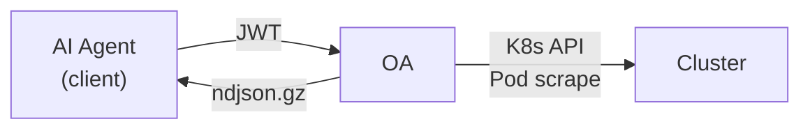

# OA — Observability Agent

> In-cluster read-only data gateway for Kubernetes logs, events, and pod metrics.

OA runs as a lightweight sidecar inside your K8s cluster and exposes a simple REST API. AI agents (or any HTTP client) authenticate with a JWT, request a **bundle** of observability data, and receive a compressed NDJSON stream ready for analysis.



---

## Features

- **Bundle-first workflow** — request a bundle, poll for completion, download a single `.ndjson.gz` artifact
- **Logs** — container logs with timestamp parsing, time-window filtering, exclude patterns, and `previous` container support
- **Events** — K8s events scoped to target pods with time-range filtering
- **Metrics** — Prometheus-annotated pod scraping with concurrency control and timeout handling
- **JWT auth** — HS256 shared-secret authentication with mandatory `exp` claim
- **Hard limits** — configurable caps on pods, log lines, metrics pods, and inflight bundles
- **Zero write** — purely read-only; never modifies cluster state

## Quick Start

```bash
# Build
npm install && npm run build

# Required: set JWT shared secret
export OA_JWT_SECRET="your-secret-here"

# Run
npm start
# → listening on http://0.0.0.0:8080
```

## API

| Method | Endpoint | Description |
|--------|----------|-------------|
| `GET` | `/healthz` | Health check (no auth) |
| `GET` | `/skill.md` | Skill manifest for AI agents (no auth) |
| `GET` | `/v1/pods?ns=*&q=<name>` | Search pods by namespace, label selector, or name |
| `POST` | `/v1/bundles` | Create a new observability bundle |
| `GET` | `/v1/bundles/:id` | Check bundle status |
| `GET` | `/v1/bundles/:id/download` | Download completed bundle (`.ndjson.gz`) |

### Create a Bundle

```bash
curl -X POST https://oa.example.com/v1/bundles \
  -H "Authorization: Bearer $TOKEN" \
  -H "Content-Type: application/json" \
  -d '{
    "timeWindow": { "sinceSeconds": 600 },
    "target": {
      "namespace": "production",
      "selector": "app=api"
    },
    "include": {
      "logs":    { "enabled": true, "tailLines": 2000, "previous": true },
      "events":  { "enabled": true },
      "metrics": { "enabled": true }
    }
  }'
```

### NDJSON Record Types

| Type | Description |
|------|-------------|
| `meta` | Bundle metadata (bundleId, params, timestamps) |
| `log` | Container log line with optional timestamp |
| `event` | K8s event (reason, message, involvedObject) |
| `metrics_text` | Prometheus scrape result (`ok`, `skipped`, or `error`) |

## Configuration

All configuration is via environment variables with sensible defaults:

| Variable | Default | Description |
|----------|---------|-------------|
| `OA_JWT_SECRET` | **required** | HS256 shared secret for JWT verification |
| `OA_PORT` | `8080` | HTTP listen port |
| `OA_BUNDLE_DIR` | `/tmp/oa-bundles` | Directory for bundle artifacts |
| `OA_BUNDLE_TTL_MINUTES` | `60` | Bundle artifact TTL |
| `OA_MAX_INFLIGHT_BUNDLES` | `5` | Max concurrent bundle jobs |
| `OA_MAX_PODS` | `20` | Hard limit on pods per bundle |
| `OA_MAX_TOTAL_LOG_LINES` | `50000` | Hard limit on total log lines |
| `OA_SINCE_SECONDS_MAX` | `3600` | Max time window (1 hour) |
| `OA_MAX_METRICS_PODS` | `20` | Max pods for metrics scraping |
| `OA_METRICS_TIMEOUT_MS` | `2000` | Per-pod metrics scrape timeout |

## Testing

```bash
npm test                 # run all tests
npm run test:watch       # watch mode
npm run test:coverage    # coverage report (98%+ target)
```

```
12 test files · 361 tests · 98%+ coverage
```

## Architecture

```
src/
├── index.ts             # Fastify app bootstrap + route handlers
├── config.ts            # Environment-based configuration
├── auth.ts              # JWT authentication hook
├── types.ts             # Shared type definitions
├── validate.ts          # Request validation + normalization
├── k8s.ts               # K8s client factory
├── k8s-compat.ts        # K8s client-node version compatibility
├── bundle-manager.ts    # Bundle lifecycle + cleanup
├── bundle-runner.ts     # Log/event/metrics collection orchestrator
├── bundle-writer.ts     # NDJSON gzip stream writer
├── semaphore.ts         # Concurrency limiter
└── skill.ts             # Skill manifest loader
```

## License

UNLICENSED — proprietary software of [1XP](https://1xp.vc).
