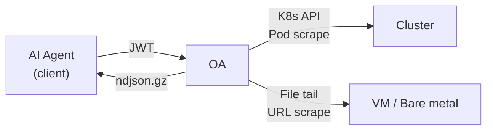

# OA — Observability Agent

> Read-only data gateway for logs, events, and metrics. Supports both Kubernetes clusters and bare metal/VM servers (standalone mode).

OA exposes a simple REST API. AI agents (or any HTTP client) authenticate with a JWT, request a **bundle** of observability data, and receive a compressed NDJSON stream ready for analysis.



---

## Features

- **Bundle-first workflow** — request a bundle, poll for completion, download a single `.ndjson.gz` artifact
- **Dual mode** — auto-detects K8s or standalone via `KUBERNETES_SERVICE_HOST`
- **Logs** — K8s container logs, standalone file tail, or journalctl (systemd), with timestamp parsing, source-appropriate time/line limits, and include/exclude patterns
- **Events** — K8s events scoped to target pods (K8s mode only)
- **Metrics** — Prometheus scraping from pod annotations (K8s) or configured URLs (standalone)
- **JWT authz** — HS256 shared-secret authentication with mandatory `exp` claim and JWT scope claims
- **Hard limits** — configurable caps on pods, log lines, and inflight bundles
- **Target read-only** — never modifies cluster or server state; writes only local bundle artifacts under `OA_BUNDLE_DIR`

## Quick Start

### K8s Mode

K8s mode is selected when `KUBERNETES_SERVICE_HOST` is present, which is normally true for in-cluster deployments.

```bash
npm install && npm run build
export OA_JWT_SECRET="replace-with-at-least-32-random-chars"
npm start
# → K8s mode detected, listening on http://0.0.0.0:8080
```

### Standalone Mode

```bash
npm install && npm run build
export OA_JWT_SECRET="replace-with-at-least-32-random-chars"
export OA_SERVICES='[
  {"name":"solana-validator","logs":["/var/log/solana/validator.log"],"metrics":"http://localhost:9090/metrics"},
  {"name":"rpc-node","logs":["/var/log/solana/rpc.log"]}
]'
npm start
# → Standalone mode, listening on http://0.0.0.0:8080
```

## API

### Common Endpoints

| Method | Endpoint | Description |
|--------|----------|-------------|
| `GET` | `/healthz` | Health check (no auth) |
| `GET` | `/livez` | Liveness check (no auth) |
| `GET` | `/readyz` | Readiness check (no auth) |
| `GET` | `/skill.md` | Skill manifest for AI agents (no auth) |
| `GET` | `/.well-known/skill.md` | Skill manifest alias (no auth) |
| `POST` | `/v1/bundles` | Create a new observability bundle |
| `GET` | `/v1/bundles/:id` | Check bundle status |
| `GET` | `/v1/bundles/:id/download` | Download completed bundle (`.ndjson.gz`) |

All non-health, non-skill endpoints require JWT auth. `OA_ALLOWED_IPS` uses the same exception list, so health and skill endpoints remain unauthenticated and outside the IP allowlist filter by design.

Protected endpoints also enforce JWT authorization claims:

```json
{
  "sub": "agent-01",
  "allowedNamespaces": ["prod", "monitoring"],
  "allowedServices": ["validator-*"],
  "capabilities": ["pods", "logs", "events", "metrics"],
  "admin": false
}
```

- K8s pod discovery requires `capabilities: ["pods"]` and an allowed namespace.
- K8s namespace scopes support exact names and `*` wildcards; `allowedNamespaces: ["*"]` permits all namespaces and `ns=*`.
- K8s selector bundles also require `pods` because selector targeting performs pod discovery internally.
- Bundle create/status/download checks the same namespace or service scope as the bundle target.
- Bundle data sources require matching capabilities: `logs`, `events`, and/or `metrics`.
- Standalone service scopes support `*` wildcards in `allowedServices`; `allowedServices: ["*"]` permits all configured services.
- Non-admin pod/service discovery responses omit sensitive fields such as pod IPs, annotations, node names, log paths, journal units, and metrics URLs.
- Legacy JWTs with no authorization scope claims keep full access for compatibility. Add `admin: false` with explicit scopes to opt into least-privilege authorization.

### K8s Mode

| Method | Endpoint | Description |
|--------|----------|-------------|
| `GET` | `/v1/pods?ns=*&q=<name>` | Search pods by namespace, label selector, or name |

### Standalone Mode

| Method | Endpoint | Description |
|--------|----------|-------------|
| `GET` | `/v1/services` | List registered services |

### Create a Bundle — K8s

```bash
curl -X POST https://oa.example.com/v1/bundles \
  -H "Authorization: Bearer $TOKEN" \
  -H "Content-Type: application/json" \
  -d '{
    "timeWindow": { "sinceSeconds": 600 },
    "target": {
      "namespace": "production",
      "selector": "app=api"
    },
    "include": {
      "logs":    { "enabled": true, "tailLines": 2000, "previous": true },
      "events":  { "enabled": true },
      "metrics": { "enabled": true }
    }
  }'
```

### Create a Bundle — Standalone

```bash
curl -X POST https://oa.example.com/v1/bundles \
  -H "Authorization: Bearer $TOKEN" \
  -H "Content-Type: application/json" \
  -d '{
    "target": {
      "kind": "services",
      "services": ["solana-validator"]
    },
    "include": {
      "logs":    { "enabled": true, "tailLines": 2000, "includePatterns": ["ERROR"], "excludePatterns": ["healthcheck"] },
      "metrics": { "enabled": true }
    }
  }'
```

Standalone targets can also use `{ "target": { "kind": "all" } }` to collect from every service registered in `OA_SERVICES`.

### NDJSON Record Types

| Type | Mode | Description |
|------|------|-------------|
| `meta` | Both | Bundle metadata (bundleId, params, timestamps) |
| `log` | K8s | Container log line (namespace, pod, container, ts, line, previous?) |
| `log` | Standalone | File log line (service, file, ts, line) |
| `log` | Standalone | Journal log line (service, journal, ts, line, journalScope?, journalUser?) |
| `log_error` | Standalone | User journal configuration or permission error (service, journal, journalScope, journalUser, ts, reason, error) |
| `log_summary` | Standalone | Log budget/source summary (lineLimited, matchedLogRecords, returnedLogRecords, sources) |
| `event` | K8s only | K8s event (reason, message, involvedObject) |
| `metrics_text` | K8s | Pod metrics scrape (namespace, pod, port, path) |
| `metrics_text` | Standalone | Service metrics scrape (service, url) |

## Configuration

All configuration is via environment variables with sensible defaults:

### Common

| Variable | Default | Description |
|----------|---------|-------------|
| `OA_JWT_SECRET` | **required** | HS256 shared secret for JWT verification (min 32 chars) |
| `OA_HOST` | `0.0.0.0` | HTTP listen address |
| `OA_PORT` | `8080` | HTTP listen port |
| `OA_BUNDLE_DIR` | `/tmp/oa-bundles` | Directory for bundle artifacts |
| `OA_BUNDLE_TTL_MINUTES` | `60` | Bundle artifact TTL |
| `OA_CLEANUP_INTERVAL_MS` | `120000` | Bundle cleanup loop interval |
| `OA_MAX_INFLIGHT_BUNDLES` | `5` | Max concurrent bundle jobs |
| `OA_MAX_TOTAL_LOG_LINES` | `50000` | Hard limit on total log lines |
| `OA_SINCE_SECONDS_MAX` | `3600` | Max time window (1 hour) |
| `OA_METRICS_TIMEOUT_MS` | `2000` | Per-target metrics scrape timeout |
| `OA_METRICS_CONCURRENCY` | `10` | K8s metrics scrape concurrency |
| `OA_ALLOWED_IPS` | *(none)* | Comma-separated IP/CIDR allowlist (e.g. `10.0.0.1,192.168.0.0/16`) |
| `OA_TRUST_PROXY` | *(none)* | Fastify `trustProxy`; prefer a specific proxy address/CIDR. `"true"` trusts all proxy headers and is unsafe on directly exposed listeners |
| `OA_JWT_ISS` | *(none)* | Optional expected JWT issuer |
| `OA_JWT_AUD` | *(none)* | Optional expected JWT audience |
| `OA_DEFAULT_SINCE_SECONDS` | `600` | Default K8s bundle time window |
| `OA_DEFAULT_TAIL_LINES` | `2000` | Default K8s log tail lines per container and standalone line-count log reads |
| `OA_DEFAULT_LOG_PREVIOUS` | `true` | Default K8s previous container log collection |
| `OA_DEFAULT_LOG_TIMESTAMPS` | `true` | Default K8s timestamp request flag |
| `OA_DEFAULT_INCLUDE_LOGS` | `true` | Default log collection |
| `OA_DEFAULT_INCLUDE_EVENTS` | `true` | Default K8s event collection |
| `OA_DEFAULT_INCLUDE_METRICS` | `true` | Default metrics collection |

### K8s Only

| Variable | Default | Description |
|----------|---------|-------------|
| `OA_MAX_PODS` | `20` | Hard limit on pods per bundle |
| `OA_MAX_METRICS_PODS` | `20` | Max pods for metrics scraping |

### Standalone Only

| Variable | Default | Description |
|----------|---------|-------------|
| `OA_SERVICES` | **required** | JSON array of service definitions |

`OA_SERVICES` format:
```json
[
  { "name": "svc-name", "logs": ["/path/to/log"], "journal": "unit.service", "metrics": "http://host:port/metrics" },
  { "name": "user-svc", "journal": "user-unit.service", "journalScope": "user", "journalUser": "ubuntu" }
]
```

- `name` (required): unique service identifier
- `logs` (optional): array of log file paths to tail
- `journal` (optional): systemd unit name for journalctl log collection
- `journalScope` (optional): `"system"` (default) or `"user"`
- `journalUser` (optional): username or UID required when `journalScope` is `"user"`
- `metrics` (optional): Prometheus metrics URL to scrape

Standalone collection is allowlisted by `OA_SERVICES`: API clients choose registered service names, not arbitrary file paths, journal units, or metrics URLs. OA does not elevate privileges. File logs and journal logs are readable only when the OA process already has the required OS permissions. For systemd, `journalctl` can show all system and user journals only when the current process account already has journal access (for example, root or an account in `systemd-journal`). Without system journal access, OA returns a skipped `log` record with `reason: "journal_permission_denied"` when journalctl reports a permission problem. Without user journal access, or when `journalUser` cannot be resolved, OA returns a `log_error` record with `journalScope` and `journalUser`.

Standalone file logs are collected with `tail -n <include.logs.tailLines>` and are not time-filtered. Standalone journal logs use either `timeWindow` (`--since`/`--until`) or `include.logs.tailLines` (`-n`), not both. When logs are enabled, `timeWindow` is accepted only for selected services with a configured journal source. Include/exclude filtering is applied before the final `maxTotalLogLines` output budget; matching records are globally merged by parsed timestamp. Untimestamped records inherit the previous timestamp seen from the same source for ranking, or source read order when no previous source timestamp exists.

Standalone log request constraints:

| Field | Applies to | Behavior |
|-------|------------|----------|
| `include.logs.tailLines` | File logs, journal logs without `timeWindow` | Source read budget; passed to `tail -n` for files and `journalctl -n` for journals |
| `timeWindow.sinceSeconds` | Journal logs only | Relative journal window; rejected when logs are enabled and selected services have no journal source |
| `timeWindow.start` / `timeWindow.end` | Journal logs only | Absolute journal window; both fields are required together; rejected when logs are enabled and selected services have no journal source |
| `limits.maxTotalLogLines` | All standalone logs | Final returned-record budget after include/exclude filtering and cross-source merge |

Metrics URLs are configured by the operator and are fetched as-is for compatibility. Treat them as trusted configuration: OA does not block localhost, private network, or metadata-address targets by default.

## Testing

```bash
npm test                 # run all tests
npm run test:watch       # watch mode
npm run test:coverage    # coverage report
```

```
592 tests across 20 files
```

## Architecture

```
src/
├── index.ts             # Fastify app bootstrap, mode branching
├── config.ts            # Environment-based configuration + mode detection
├── auth.ts              # JWT authentication hook
├── ip-filter.ts         # IP allowlist filter hook
├── types.ts             # Shared type definitions (BundleJob, BundleStatus)
├── log-utils.ts         # Shared log parsing utilities
├── bundle-manager.ts    # Bundle lifecycle + cleanup (generic)
├── bundle-writer.ts     # NDJSON gzip stream writer
├── semaphore.ts         # Concurrency limiter
├── http-error.ts        # HTTP error class
├── util.ts              # Shared utilities
├── skill.ts             # Skill manifest loader
├── k8s/
│   ├── client.ts            # K8s client factory
│   ├── compat.ts            # K8s client-node version compatibility
│   ├── types.ts             # K8s-specific types (PodRef, BundleRequest)
│   ├── validate.ts          # K8s request validation + normalization
│   ├── routes.ts            # K8s HTTP route handlers
│   ├── pod-resolver.ts      # Pod target resolution (selector/direct)
│   ├── bundle-runner.ts     # K8s log/event/metrics orchestrator
│   ├── log-collector.ts     # K8s container log collection
│   ├── event-collector.ts   # K8s event collection
│   └── metrics-collector.ts # K8s pod metrics scraping
└── standalone/
    ├── types.ts             # ServiceDef, StandaloneNormalizedRequest
    ├── validate.ts          # Standalone request validation
    ├── routes.ts            # Standalone HTTP route handlers
    ├── bundle-runner.ts     # Standalone collection orchestrator
    ├── file-tail.ts         # tail(1)-based file tail
    ├── journal-reader.ts    # journalctl (systemd) log reader
    ├── log-collector.ts     # File + journal log collection
    └── metrics-collector.ts # URL-based metrics scraping
```

## License

Apache-2.0 — see [LICENSE](./LICENSE) for details.
